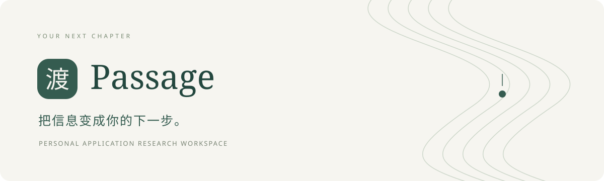
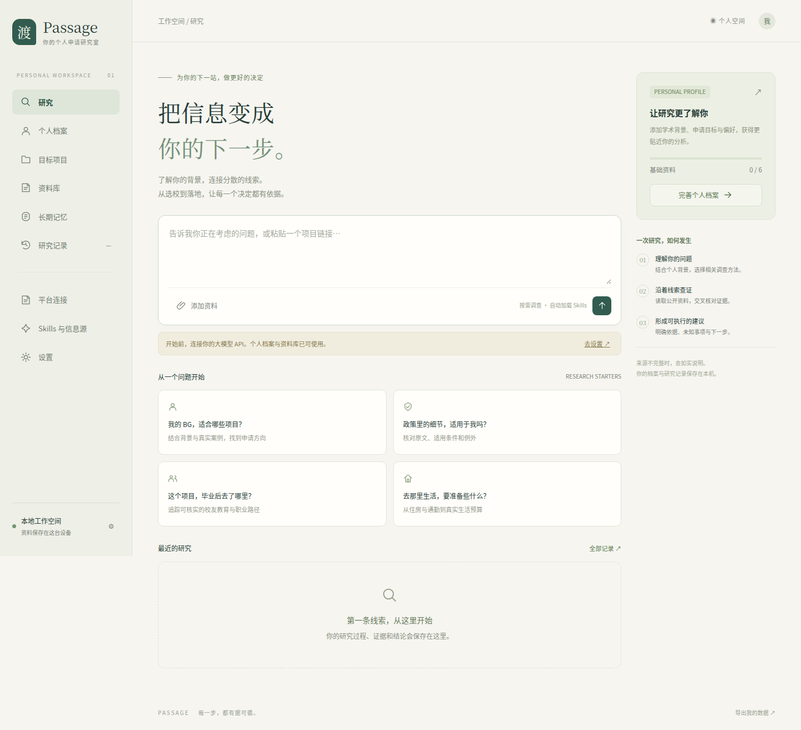
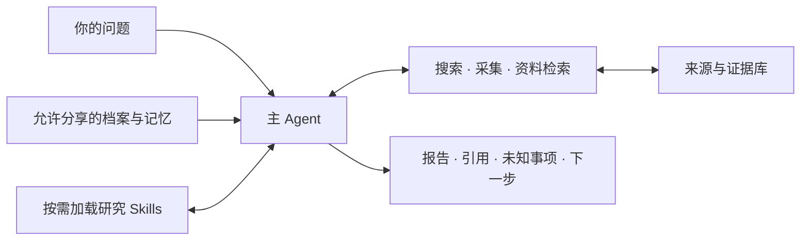

<div align="center">



# 渡 · Passage

**你的个人申请研究室**

了解你的背景，连接分散的线索。<br>
从选校到落地，让每一个决定都有依据。

[快速开始](#快速开始) · [界面预览](#界面预览) · [使用指南](docs/usage.md) · [架构说明](docs/architecture.md)

</div>

---

## 为什么叫「渡」

申请，是从熟悉的此岸，走向尚未展开的下一站。

**Passage** 可以是一条通道、一段旅程，也可以是一段文字。我们从一段段文字中寻找线索，再把线索变成前行的方向。「渡」与它意境相通：穿过信息的河流，为自己的下一步作出选择。

Passage 是一个在本机运行的 AI 申请研究工作空间。它记住你的背景与偏好，按问题调用研究 Skills，搜索网页、读取资料、整理证据，形成带来源、未知事项和下一步建议的报告。

## 从这些问题开始

> 我的 BG 与目标项目是否匹配？哪些条件还需要补强？
>
> 这条签证或学校政策，具体适用于我的情况吗？
>
> 这个项目的校友毕业后去了哪里？这些样本能说明什么？
>
> 去那里生活，住房、通勤和预算该怎么准备？

## 界面预览



<sub>应用实际界面，截图来自空白测试工作空间，不包含个人档案或真实申请案例。支持桌面和移动尺寸；默认服务仅在本机开放。</sub>

## 能做什么

| 能力 | 使用体验 |
| --- | --- |
| **个人档案与简历解析** | 导入简历 PDF，预览文字，核对模型提取的字段与原文，再选择写入档案。 |
| **按问题展开研究** | 一个主 Agent 按需加载六个 Skill：BG 匹配、政策核查、校友路径、项目培养、生活成本、项目比较。 |
| **连接分散的信息** | 通用联网搜索、公开网页与 PDF 读取、文字导入、本地资料检索。 |
| **小红书与 LinkedIn** | 实验性独立浏览器连接；手动登录并启用后，搜索和采集可见内容。 |
| **有来源的报告** | 区分搜索摘要和已读取正文，保留引用、信息缺口与下一步建议，支持追问及 Markdown 导出。 |
| **持续积累背景** | 档案版本、可编辑的长期记忆、目标项目与研究笔记；模型提出的记忆由你确认。 |
| **可控的研究过程** | 查看执行进度，设置搜索、页面、轮数与时间预算，停止或恢复任务。 |

## 快速开始

需要 **Python 3.11+**。下载或克隆仓库后，在项目根目录运行：

```bash
python3 -m venv .venv
source .venv/bin/activate
pip install -r requirements.txt
python run.py
```

Windows PowerShell 使用 `.venv\Scripts\Activate.ps1` 激活环境，其余命令相同；创建环境时可使用 `python -m venv .venv`。

打开 **[localhost:8765](http://127.0.0.1:8765)**。

无需 Node.js、前端构建或云数据库。应用默认仅监听 `127.0.0.1`，适合个人本机使用；当前不适合直接部署到公网。

### 开始你的第一次研究

1. **连接模型** — 在「设置」填写服务地址、模型名称与 API Key，保存并测试。支持具有工具调用能力的 Chat Completions 兼容模型，包括兼容的 DeepSeek 服务和本机模型服务。
2. **建立档案** — 手动填写背景，或在「个人档案」导入简历 PDF，核对后保存。
3. **准备信息源** — 可配置 Tavily 进行通用搜索，也可先导入资料或提供公开链接。社媒连接单独配置。
4. **提出问题** — 选择参考资料，发起研究，在详情页查看进度、证据和结论。

未配置模型时，档案、收藏、记忆与资料库仍可使用。模型和搜索服务的费用由对应服务商收取。

<details>
<summary><strong>模型地址与环境变量</strong></summary>

模型地址填写服务商根路径或 `/v1`，不包含 `/chat/completions`，例如 `https://api.deepseek.com`。模型名称以你的账户可用模型为准；原生非兼容协议需要另加适配器。

| 变量 | 用途 |
| --- | --- |
| `LLM_BASE_URL` / `LLM_MODEL` / `LLM_API_KEY` | 模型配置后备值 |
| `TAVILY_API_KEY` | 通用搜索凭据后备值 |
| `PORT` | 服务端口，默认 `8765` |
| `APPLICATION_HELPER_DATA` | 数据目录，默认 `data/` |
| `APPLICATION_HELPER_BROWSER` | 社媒采集所用的 Chromium 系浏览器路径 |

网页保存的模型和搜索设置优先于环境变量。程序不会自动读取 `.env` 文件。现有 `APPLICATION_HELPER_*` 变量名保留，方便已有配置继续使用。

</details>

详细步骤：[简历 PDF 导入](docs/usage.md#简历-pdf-导入) · [平台连接](docs/usage.md#平台连接小红书与-linkedin) · [数据与访问](docs/usage.md#数据与访问)

## 一次研究，如何发生



Skill 描述调查方法，模型决定下一步调用，后端执行工具并校验参数、访问范围和预算。任务、证据和完整工具轮次的检查点保存在 SQLite，便于后续追问与恢复。

技术组成：**Python · FastAPI · SQLite · Playwright · 原生 JavaScript / CSS**。

## 数据由你掌握

- 档案、记忆和研究记录保存在本机 `data/`；模型与搜索密钥存于本机明文配置文件，不回显到页面或包含在 JSON 导出中。
- 调用外部模型时，会发送问题和相关资料；档案与已确认记忆可在设置中关闭分享。简历解析会在你点击发送后，将预览框文字交给所选模型。
- 原始简历 PDF 和解析草稿不写入数据库。社媒登录态仅存于独立浏览器目录，可在界面清除。
- 历史研究可能保留当时使用的资料片段。删除资料或记忆不会同步删除历史研究，完整清理时需一并删除相关记录。

具体存储位置、采集规则与删除语义见[使用指南](docs/usage.md#数据与访问)。默认数据目录、环境文件、虚拟环境和测试输出均已加入 `.gitignore`。

## 当前边界

项目处于早期开发阶段，以下限制仍然存在：

- **引用可追溯不等于判断一定正确。** 录取匹配、政策适用性与校友身份仍需核实；不提供有统计校准的录取概率。
- **平台接入有边界。** 小红书与 LinkedIn 使用实验性浏览器适配器，真实账号及实时页面需要实测。LinkedIn 限制自动化访问，存在账号受限风险；遇到验证码、登录失效或限流会暂停。详见[连接说明](docs/usage.md#平台连接小红书与-linkedin)。
- **来源覆盖有限。** Reddit 未接入自动采集；一亩三分地公开页面探测曾遇到连接重置；csapp 的具体目标站点尚待确定。不会绕过登录、积分或验证码。
- **文档解析有范围。** 简历支持带文本层的 PDF，限 5 MB、20 页、30,000 字符；通用 PDF 读取前 40 页、最多 45,000 字符。OCR、图片和视频解析尚未实现。
- **检索与分析仍在演进。** 本地检索使用关键词匹配；尚无向量检索、校友身份审核工作台或结构化去向统计。

## 后续方向

- [ ] 扫描简历 OCR 与更好的多栏排版解析
- [ ] 政策与项目变更订阅、定时更新
- [ ] 校友身份核对、样本覆盖与去向分析
- [ ] 更丰富的信息源适配器与检索方式

这些是探索方向，不代表已经实现或承诺交付时间。

## 开发与验证

```bash
pip install -r requirements-dev.txt
python -m pytest -q
python -m tests.browser_smoke
python -m tests.social_browser_smoke
```

浏览器测试默认使用 `/usr/bin/microsoft-edge`；其他 Chromium 系浏览器可用 `BROWSER_PATH` 指定。测试在临时数据库运行，界面测试使用 `8766` 端口，截图写入 `test-results/`。可安装 `requirements-lock.txt` 复现当前依赖快照。

当前验证记录：**45 项后端测试通过**，另有界面与社媒适配器浏览器测试。模型使用测试夹具，这不代表实际模型回答质量或真实账号采集已验证。见[完整验证记录](docs/validation.md)。

```text
app/          API、Agent、模型接入、采集、简历解析与存储
skills/       六个研究方法的 SKILL.md
static/       无构建步骤的前端
tests/        后端与浏览器测试
scripts/      小样本公开来源探测
docs/         使用指南、架构、验证记录与展示素材
```

新增调查方法可以从 `skills/` 开始；新增信息源则扩展工具或采集适配器。设计细节见[架构说明](docs/architecture.md)。欢迎提交可复现的问题、信息源建议与改进。

---

<div align="center">

**渡向下一站，每一步都有据可循。**

</div>
